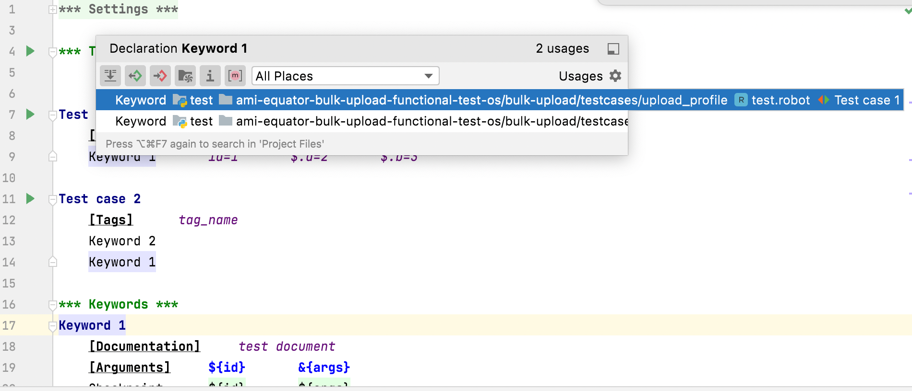
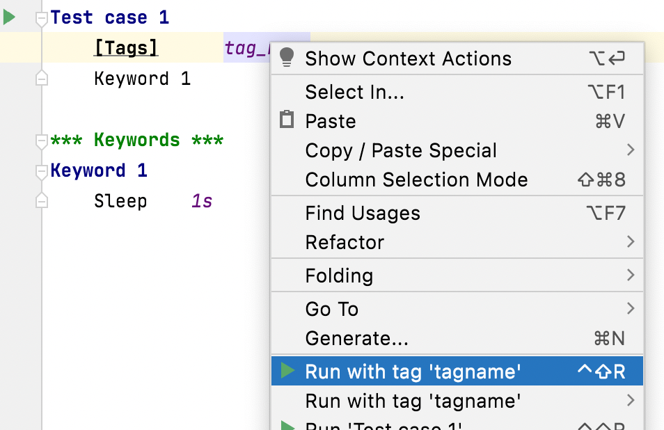
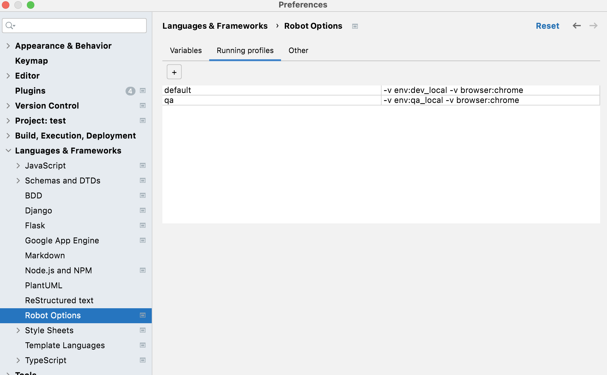
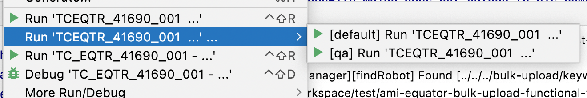

# RobotFrameworkHelper
<!-- Plugin description -->
Robot Framework Plugin for PyCharm.

Forked from https://github.com/mtrubs/intellibot

## Installation
* Install from Jetbrains Marketplace https://plugins.jetbrains.com/plugin/21066-robotframework-helper

## Features
* Structure navigation 
* Syntax Highlighting
* Suggestion and find usage
  
* 
* Cases or Suites Execution
  
* Supported Resource File
* Replace for predefined variables
* Refactoring keywords & variables
  
* Config for default execution variables
  * Config to add variable when running testcases (--variable parameter)
  
* Detect run test case or tag
  
* Running with pre-config profile
  * Go to config -> add multiple set of parameters
  
  * In run menu will show option to run with configured set
  
  

<!-- Plugin description end -->
